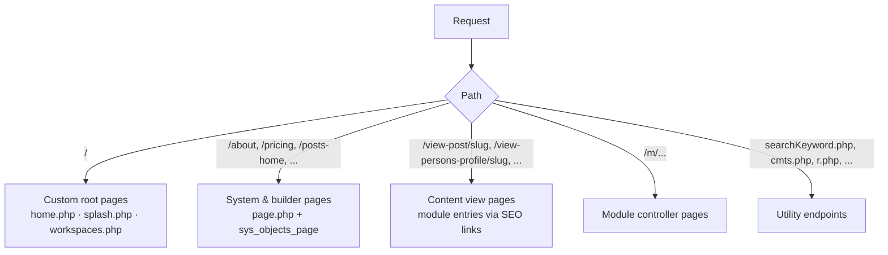

# GFunnel SEO Page Map

A complete account of every page family on gfunnel.com, how each one is
produced, which parts of its SEO structure are in place, and what still needs
work. Companion to the automatic sitemap module in `modules/gfunnel/sitemap/`.

*Audited: July 2026, branch `claude/seo-audit-sitemap-automation-ttbeyy`.*

---

## 1. How pages are produced

gfunnel.com runs on UNA CMS with GFunnel customizations. Every URL on the
site belongs to one of five families:

| # | Family | Rendered by | Indexable? | SEO verdict |
|---|--------|-------------|------------|-------------|
| A | Custom root pages (`/`) | `home.php`, `splash.php`, `workspaces.php` | `/` for guests: **yes** | ⚠️ was title-only — **fixed on this branch** for `home.php` |
| B | System & builder pages (`/about`, `/pricing`, `/posts-home`, …) | `page.php` + Studio page builder | yes | ⚠️ framework complete, **per-page values mostly unfilled**, no canonical |
| C | Content view pages (`/view-post/…`, `/view-event-profile/…`, …) | module `PageEntry` classes | yes | ✅ structurally complete and automatic |
| D | Profile pages (`/view-persons-profile/…`, orgs, groups, spaces, …) | same base class as C | yes | ✅ same as C |
| E | Utility endpoints (`searchKeyword.php`, `cmts.php`, `r.php`, …) | standalone root scripts | **no — should never be indexed** | ⚠️ were crawlable/in sitemap — **now blocked by robots.txt** |

---

## 2. What every page emits (the shared head pipeline)

All server-rendered pages go through `BxDolTemplate::getMetaInfo()`
(`inc/classes/BxDolTemplate.php:1287`), which emits:

- `<title>` — from the page header (always present)
- `<meta name="description">` — only if the page supplies one
- `<meta name="keywords">` — only if supplied (content pages get these from metatags/hashtags)
- `og:title`, `og:description`, `twitter:card` — always emitted; **empty when no description/header**
- `og:image` — page cover if set, else entry image, else the site's Android/Apple icon (`sys_site_icon_*` settings)
- `og:url`, `og:type`, `og:site_name`, `twitter:title`, `twitter:description`, `twitter:image` — **now emitted for every page** (added this branch; previously og:url/site_name/type and all twitter:* except the card were missing)
- `<link rel="canonical">` — **now self-referencing on every page** (added this branch): content pages canonicalize to their entry URL, plain/system pages to their own page URI, collapsing `/uri` vs `/page/uri` vs `?i=uri` duplicates
- geo meta, RSS alternate, oEmbed discovery — when applicable
- `<meta name="robots">` — per-page `meta_robots` field from Studio

So the framework is complete; whether a given page is "proper" depends on
whether its family feeds this pipeline. That's what the rest of this map shows.

---

## 3. Family A — custom root pages

| Page | Serves | Title | Meta description | OG | Canonical | Robots |
|------|--------|-------|------------------|----|-----------|--------|
| `home.php` | `/` for logged-out visitors — **the** SEO landing page | ✅ | ❌ → ✅ **added** (`gf_home_meta_description` setting, strong default) | ⚠️ og:description empty → ✅ fixed; og:image falls back to site icon | ❌ → ✅ **added** (site root) | index |
| `splash.php` | `/` when splash mode is on (currently off — `home.php` wins) | ✅ | ❌ | ⚠️ | ❌ | index |
| `workspaces.php` | `/` for logged-in members | ✅ | n/a — never seen by crawlers (guests get `home.php`) | n/a | n/a | n/a |

**Fixed on this branch:** `home.php` now sets a meta description (override via
the `gf_home_meta_description` setting) and a canonical to the site root.
`splash.php` is currently unused; if it's ever re-enabled it needs the same
two lines.

---

## 4. Family B — system & builder pages (`page.php` / `sys_objects_page`)

These are the ~200 Studio-managed pages: marketing/legal pages (`about`,
`pricing`, `terms`, `privacy`, `cancellation-policy`, `business`, `explore`,
`opportunities`, `mentors`, `jobs`, `crm`, `communities`, …) and every module's
home/browse pages (`posts-home`, `events-home`, `market-home` a.k.a.
`products-*`, `discussions-home`, `goal-home`, `listing-home`, …).

Structure status:

| Element | Status | Detail |
|---------|--------|--------|
| Title | ✅ automatic | page title from Studio, wrapped in the site title pattern |
| Meta description | ⚠️ **supported but empty on most pages** | per-page `meta_description` field, Studio → Pages → SEO block. Nothing fills it automatically for builder pages |
| Meta keywords | ⚠️ same | per-page field |
| Meta robots | ✅ supported | per-page field; also honored by the new sitemap generator (noindex pages are excluded) |
| OG / Twitter tags | ✅ **now complete** | og:title/description/url/type/site_name and twitter:card/title/description/image all emitted; og:description still needs the meta description below to be filled to be non-empty |
| Canonical | ✅ **now emitted** | `BxBasePage::_addSysTemplateVars` now sets a self-referencing canonical to the page's own URI when the page doesn't set one |
| Visibility | ✅ | guest visibility honored via membership levels; the sitemap generator only lists guest-visible, non-noindex pages |

**Needs work (content task, no code):** fill Studio → Pages → SEO
meta description for the ~20 pages that matter for search:
`about`, `pricing`, `business`, `explore`, `communities`, `opportunities`,
`mentors`, `jobs`, `crm`, `terms`, `privacy`, `cancellation-policy`,
`intellectual-property`, `help`, `contact`, plus the module homes
(`posts-home`, `events-home`, `courses-home`, `market-home`,
`discussions-home`, `persons-home`, `organizations-home`, `spaces-home`).

**Done this branch:** self-referencing canonical for plain system pages, added
in `BxBasePage::_addSysTemplateVars`, killing duplicate-URL indexing
(`/about` vs `/page/about` vs `/page.php?i=about`).

---

## 5. Families C & D — content and profile view pages

All content types share `BxBaseModGeneralPageEntry`
(`modules/base/general/classes/BxBaseModGeneralPageEntry.php`); profile types
(persons, organizations, groups, spaces, events, courses, channels) extend it.
Every one of these pages automatically gets:

- ✅ title from the entry title
- ✅ meta description auto-generated from the entry text (first ~240 chars), falling back to the page's Studio value
- ✅ og:image from the entry's photo/cover (falls back to site icon)
- ✅ keywords from the entry's metatags/hashtags
- ✅ canonical via `setPageUrl('page.php?i=<view-uri>&id=<id>')` → resolves to the SEO link
- ✅ SEO-friendly slugs (`/view-post/my-post-title`) via `sys_seo_links`, created on first render
- ✅ access control: private/unapproved content renders access-denied and never reaches crawlers

Installed content types and their public view pages (all now feed the sitemap
automatically; "profile" = also requires an active `sys_profiles` row):

| Module | View URI | Notes |
|--------|----------|-------|
| bx_persons | `view-persons-profile` | profile |
| bx_organizations | `view-organization-profile` | profile |
| bx_groups | `view-group-profile` | profile; private groups excluded via privacy filter |
| bx_spaces | `view-space-profile` | profile |
| bx_events | `view-event-profile` | profile |
| bx_courses | `view-course-profile` | profile |
| bx_channels | `view-channel-profile` | profile |
| bx_posts | `view-post` | |
| bx_forum | `view-discussion` | |
| bx_market | `view-product` | |
| bx_classes | `view-class` | |
| bx_ads | `view-ad` | |
| bx_albums / bx_photos / bx_videos / bx_files | `view-album` / `view-photo` / `view-video` / `view-file` | media pages; thinner but legitimate |
| bx_polls | `view-poll` | |
| bx_glossary | `view-glossary` | |
| bx_shopify / bx_snipcart | `view-shopify-entry` / `view-snipcart-entry` | |
| mz_goal | `view-goal` | |
| mz_jobs | `view-job` | |
| mz_listing | `view-listing` | |
| mz_news | `view-news` | |
| Excluded by default | `view-convo`, `view-task`, `item` (timeline), `view-stream`, messenger | private / ephemeral / thin duplicates |

**Verdict: this is the healthy part of the site.** No structural work needed.
Quality depends on authors writing real titles/text, which the auto-description
then reuses.

---

## 6. Family E — utility endpoints

Root-level scripts that render fragments, redirects or tools and must stay out
of search: `searchKeyword.php`, `searchExtended.php`, `cmts.php` (+
`cmts-view` pages), `vote.php`, `score.php`, `favorite.php`, `report.php`,
`form.php`, `embed.php`, `r.php`, `storage.php`, `acl-view`, plus the auth
pages (`login`, `create-account`, `forgot-password`).

- ❌ Before: nothing prevented crawling — the old sitemap even *submitted* 28
  `searchKeyword.php` URLs, 25 `cmts-view?…&cmt_id=…` permalinks and the
  login/signup pages to Google.
- ✅ Now: `/robots.txt` (new, served dynamically by `robots.php`) disallows all
  of them, and the new sitemap generator has them on a hard deny list.

Also found: root `index.html` and `default.php` are leftover hosting
placeholders ("Default page"). They're unreachable in practice (Apache serves
`index.php` first) but are dead weight — safe to delete whenever.

---

## 7. The old sitemap.xml — why it had to go

The file this branch replaces was a **static crawler export, not a sitemap**:

| Problem | Evidence |
|---------|----------|
| Frozen in time | every one of its URLs had `lastmod = 2024-12-15` — nothing added since |
| Arbitrarily capped | exactly 3,000 URLs (crawler limit), so most real content was missing |
| ~80% junk | ~2,400 URLs were per-profile tab pages (`joined-events`, `posts-author`, `goal-author`, …) — thin duplicates that dilute crawl budget |
| Actively harmful entries | `login`, `create-account`, `forgot-password`, `acl-view`, `searchKeyword.php?…`, comment permalinks with query strings |
| Useless signals | every URL `priority 0.8, changefreq weekly` — no differentiation |
| No discovery | no `robots.txt`, so the sitemap URL wasn't even advertised to crawlers |

**Replaced by:** the dynamic module (`modules/gfunnel/sitemap/`) — see its
README for architecture, settings and the one-time install command
(`php modules/gfunnel/sitemap/install.php`). `/sitemap.xml` now always
reflects live data: real `lastmod` per entry, weighted priorities, junk
excluded, auto-splitting into a sitemap index past 45k URLs, and every newly
published page/entry appears without anyone touching anything.

---

## 8. Priority worklist

Done (technical foundation — all in code, no per-page input needed):

1. ✅ Automatic, always-current `/sitemap.xml` (+ cron + on-demand rebuild)
2. ✅ `/robots.txt` with utility-endpoint disallows and the `Sitemap:` directive
3. ✅ Stale static `sitemap.xml` removed
4. ✅ Homepage meta description + canonical (`home.php`)
5. ✅ **Self-referencing canonical on every page** (`BxBasePage`) — kills duplicate-URL indexing
6. ✅ **Complete Open Graph + Twitter Card tags on every page** (`BxDolTemplate::getMetaInfo`)
7. ✅ **Organization + WebSite JSON-LD on the homepage** (`home.php`) — brand knowledge panel + sitelinks search box

Remaining:

1. **Run the sitemap installer / SQL on the server** (see `modules/gfunnel/sitemap/README.md`),
   verify `https://gfunnel.com/sitemap.xml`, resubmit in Google Search Console
   and Bing Webmaster Tools.
2. **Per-page copy — the last real gap (needs the SEO strategy):** meta
   descriptions, title patterns and target keywords for the ~20 key landing
   pages in section 4. This is content, not code — stored per page in
   `sys_objects_page.meta_description` (Studio → Pages → SEO), and can be
   applied in bulk via `UPDATE` SQL once the copy is written.
3. **Set the site icon images** in Studio → Settings — they are the og:image
   and Organization `logo` fallback for pages without their own image.
4. **Set `gf_org_same_as`** (sys_options) to the official social profile URLs
   so the Organization JSON-LD emits `sameAs` (entity disambiguation).
5. Optional next step: `Product`/`Event`/`Course` JSON-LD on those content view
   pages (per-module templates) for rich results.
6. Housekeeping: delete root `index.html` / `default.php` placeholders; add the
   same description/canonical lines to `splash.php` if it's ever re-enabled.
